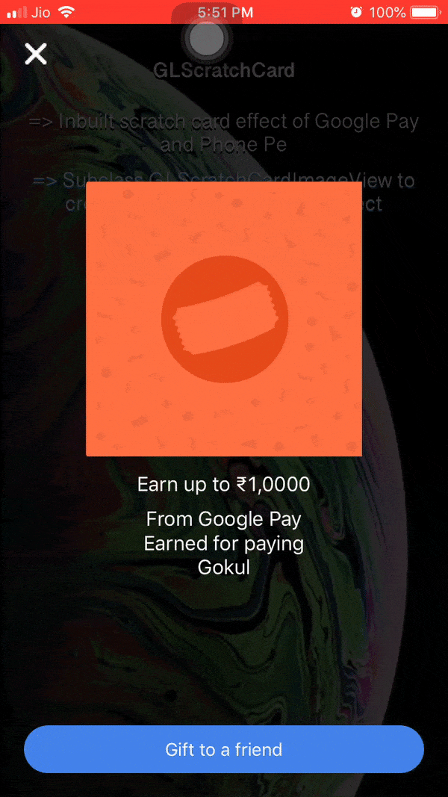
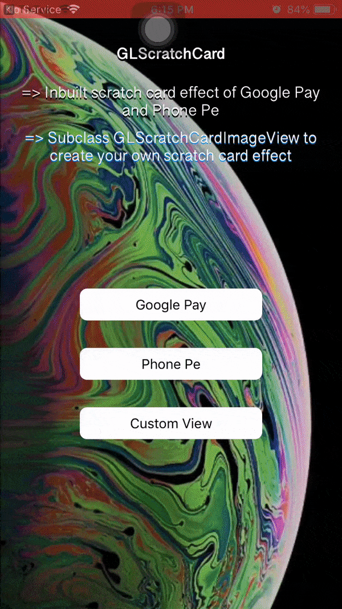

# GLScratchCard


[](https://travis-ci.org/gokulece26@gmail.com/GLScratchCard)

[](https://cocoapods.org/pods/GLScratchCard)

[](https://cocoapods.org/pods/GLScratchCard)

[](https://cocoapods.org/pods/GLScratchCard)


## Example


To run the example project, clone the repo, and run `pod install` from the Example directory first.


## Requirements


`GLScratchCard` XCode 10 and Swift 4.2. With deployment target `11.0`.


## Installation


## Cocoapods


`GLScratchCard` is available through [CocoaPods](https://cocoapods.org). To install

it, simply add the following line to your Podfile:


```ruby

pod 'GLScratchCard'

```

## Manual

Copy the files from ~/Pods/DevelopmentPods/GLScratchCard/ to your project.


## User Guide

### Basic Usage

let controller = GLScratchCardController()
controller.scratchCardView.addDelegate(delegate: self)
controller.scratchCardView.bottomLayerView = UIImageView(image: UIImage(named: "cash_back"))
controller.scratchCardView.topLayerImage = UIImage(named:"scratch_image")!
controller.presentScratchController()



### Break Down
let controller = GLScratchCardController() 

### Setting up Components

Titles to be shown initilly, before scratch starts

controller.scratchCardView.doneButtonTitle = "Gift to a friend"
controller.scratchCardView.scratchCardTitle = "Earn up to ₹1,0000"
controller.scratchCardView.scratchCardSubTitle = "From Google Pay \nEarned for paying \nGokul"

Title to be show after scratch ends,

controller.scratchCardView.afterScratchDoneButtonTitle = "Done"
controller.scratchCardView.afterScratchTitle = "Woohoo!"
controller.scratchCardView.afterScratchSubTitle = "Expect payment within a weak."

Top layer image view,

controller.scratchCardView.topLayerImage = UIImage(named:"scratch_image")!

Bottom layer image view (one that will be reviled after scratching ends),

controller.scratchCardView.bottomLayerView = UIImageView(image: UIImage(named: "cash_back"))

Can customise scratch size and shape (.round, .square, .butt),

controller.scratchCardView.scratchCardImageView.lineWidth = 50
controller.scratchCardView.scratchCardImageView.lineType = .round

### Delegates

1. GLScratchCardDelegate
2. GLScratchCarImageViewDelegate

Add delegates,

controller.scratchCardView.addDelegate(delegate: self)
controller.scratchCardView.scratchCardImageView.addDelegate(delegate:self)

#### GLScratchCardDelegate

func didCloseButtonPressed(sender: UIButton)
func didDoneButtonPressed(sender: UIButton)

#### GLScratchCarImageViewDelegate

func scratchpercentageDidChange(value: Float)
func didScratchStarted()
func didScratchEnded()



## Author

Gokul, gokulece26@gmail.com


## Social


*  [Facebook](https://www.facebook.com/gokul.rockzz.1)

*  [Twitter](https://twitter.com/gokulgovind_)

*  [StackOverflow](http://stackoverflow.com/users/5582022/gokul?tab=profile)

*  [Linkedin](https://www.linkedin.com/in/gokul-govind-1b0232105?trk=nav_responsive_tab_profile)


## License

GLScratchCard is available under the MIT license. See the LICENSE file for more info.
